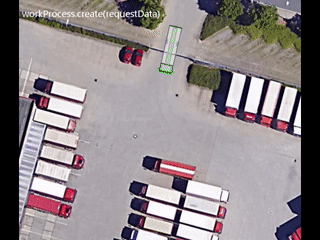

<div id="top"></div>


<!-- PROJECT LOGO -->
<br />
<div align="center">
  <a href="https://helyosframework.org/">
    
  </a>

  <h3 align="center">helyOS Javascript SDK</h3>

  <p align="center">
    A Javascript wrap for helyOS GrapQL interface.
    <br />
    <a href="https://helyosframework.github.io/helyos-javascript-sdk/classes/HelyosServices.html"><strong>Explore the docs »</strong></a>
    <br />
    <br />
    <a href="https://github.com/">View Demo</a>
    ·
    <a href="https://github.com/helyOSFramework/helyos-javascript-sdk/issues">Report Bug</a>
    ·
    <a href="https://github.com/helyOSFramework/helyos-javascript-sdk/issues">Request Feature</a>
  </p>
</div>

## About The Project

The helyosjs-sdk helps the development of javascript applications using the helyOS framework.
This library contains all necessary methods and entity types to build a front-end using helyOS as backend system. 




### List of features

*   Log in as administrator or regular user.
*   List and edit automatons (agents).
*   Retrieve sensors data and work process status.
*   Create, schedule and handle work processes.
*   Manage and edit yards: set drivable areas, gates, obstacles, etc.


### Built With

* [Typescript](https://www.typescriptlang.org/)
* [Apollo](https://www.apollographql.com/)
* [Socket.io](https://socket.io/)

## Getting Started

### Installation

```shell 
$ npm i helyosjs-sdk  --save
```

### Usage

```js 
import { HelyosServices, H_Agents  } from 'helyosjs-sdk';

const helyosService = new HelyosServices('http://localhost', {socketPort:'5002', gqlPort:'5000'});

const username = 'admin@email.com';
const password = 'password';

 helyosService.login(username, password)
.then( response => helyosService.connect())
.then( connected => console.log(connected));;

function listAgents(conditions={}) {
    return helyosService.agents.list(conditions)
    .then((agents: H_Agent[]) => {
        console.log(agents);
    });
}

function editTool(patch: H_Agents) {
    return helyosService.agents.patch(patch)
    .then(agents => {
        console.log(agents);
    )}
}
```

### Listening agent/agent sensors and work process status

```js 

helyosService.connect()
.then(() => {
            const socket = helyosService.socket;

            socket.on('new_agent_poses',(updates)=>{
                console.log(updates);  // Notifications from agent sensors.
            });

            socket.on('change_agent_status',(updates)=>{
                console.log(updates);  // Notifications from agents working status.
            });

            socket.on('change_work_processes',(updates)=>{
                console.log(updates);  // Notifications from work processes status.
            });
});


```

### Command Reference

| Command | Description |
| --- | --- |
| `helyosService.register(email,password,adminPassword): Promise` | Register new user. |
| `helyosService.login(username, password): Promise` | User login. |
| `helyosService.connect(): Promise` | Establish websocket connection after logged. |
| `helyosService.logout(): Promise` | User logout. |
| `helyosService.changePassword(user,password,newPassword): Promise` | Change password. |
| --- | --- |
| EXAMPLE OF CRUD OPERATIONS |  |
| `helyosService.workprocess` | Work Processes services |
| .list (condition: Partial<H_WorkProcess>): Promise<H_WorkProcess[]>| list all work processes filtered by condition. |
| .create (data: H_WorkProcess): Promise<H_WorkProcess> | create work process. |
| .get (workProcessId: number): Promise<H_WorkProcess> | get work process by ID. |
| .patch (data:Partial<H_WorkProcess>): Promise<H_WorkProcess> | edit work process. |
| --- | --- |


### Most important models

| Model | Description |
| --- | --- |
| `H_Agents` | Tool represents a sensor or any movable device that can perform an action |
| id: number | unique db identifcation number |
| code: number | unique identifcation number |
| name: string | agent name  |
| picture: string | base64 jpg |
| yardId: number | to which yard this agent is associated.|
| status: string | 'busy', 'free' |
| picture: string | base64 jpg |
| geometry: JSON |  Description of the agent geometry |
| heartbeat: Date |  Last time agent contacted the yard base |
| --- | --- |
| `H_Yard` | Physical space enclosing agents in a drivable area. |
| id: number | unique db identifcation number |
| name: string | yard name  |
| picture: string | base64 jpg |
| mapData:  {origin: {lat?: number, lon?: number, zoomLevel?: number}}  | base64 jpg |
| --- | --- |
| `H_MapObject` | Define objects in the yard map: areas or lines.  |
| id: number | unique db identifcation number. |
| yardId: number | associated yard.|
| deletedAt: Date | when shape was marked deleted. |
| type: string | type of object: "obstacle", "parking-area", "gate", etc. |
| data: Object | user-defined arbitrary data format |
| dataFormat: string | name of the data format |
| --- | --- |
| `H_WorkProcess` | Group and serialize actions to be executed by the agents. |
| id: number | unique db identifcation number. |
| schedStartAt: date | date and time when the process is scheduled to start. |
| schedEndAt: date | date and time when the process is predicted to end. |
| startedAt: date | date and time of actual start. |
| endedAt: date | date and time of actual end. |
| status: string |status. |
| processType: string |status. |
| data:  MoveToTargetDescriptor \| MoveFreeDescription | Any JSON data that describes the actions. |
| --- | --- |


## Version Compatibility

| helyosjs-sdk Version | helyOS_core Version |
|----------------------|---------------------|
| 2.0.3                | 2.0.3, 2.0.4        |
| 2.0.4                | 2.0.4               |
| 2.0.5                | 2.0.4, 2.0.5        |
| 2.0.6                | 2.0.5               |
| 2.1.0                | 2.1.0               |


### Contributing

Keep it simple. Keep it minimal.
If you have any question, please write to our [Discussion](https://github.com/helyOSFramework/helyos_core/discussions/) forum.


### License

This project is licensed under the MIT License
